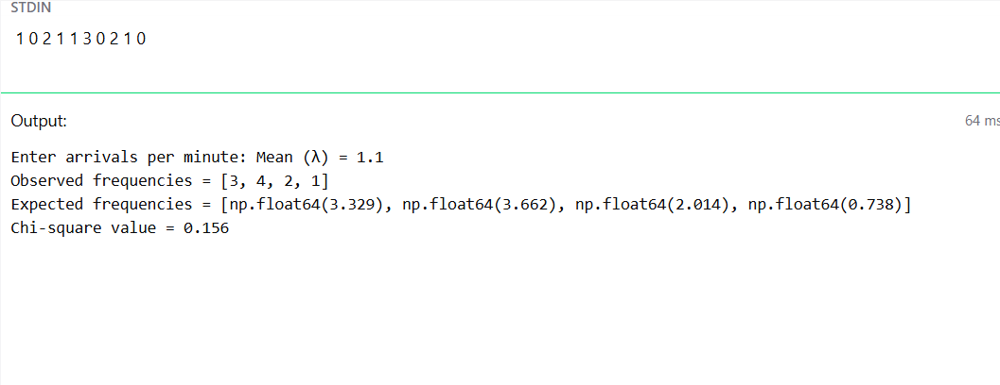

# Fitting Poisson  distribution

# date : 04/02/2026

# Aim : 

To fit poisson distribution for the arrival of objects per minute from the feeder

# Software required :  

Python and Visual component tool

# Theory:

The Poisson distribution is the discrete probability distribution of the number of events occurring in a given time period, given the average number of times the event occurs over that time period.


 Conditions for Poisson Distribution:

1. An event can occur any number of times during a time period.
2. Events occur independently. I
3. The rate of occurrence is constant.
4. The probability of an event occurring is proportional to the length of the time period. 
 
# Procedure :


# Experiment :


# Program :

```
# Developed by : Ryan David Prasad
# Register No : 212224040282

import numpy as np
import math

# Input arrival data
L = [int(i) for i in input("Enter arrivals per minute: ").split()]

N = len(L)
mean = np.mean(L)        # λ for Poisson distribution

M = max(L)
x = list(range(M+1))

# Observed frequency
f = [L.count(i) for i in x]

# Expected frequency using Poisson formula
E = []
for i in x:
    p = (math.exp(-mean) * mean**i) / math.factorial(i)
    E.append(N * p)

# Chi-square calculation
chi = sum((f[i] - E[i])**2 / E[i] for i in range(len(x)) if E[i] != 0)

print("Mean (λ) =", round(mean,3))
print("Observed frequencies =", f)
print("Expected frequencies =", [round(i,3) for i in E])
print("Chi-square value =", round(chi,3))
```

# Output : 



# Results

The Poisson distribution is fitted for the objects arrived from feeder per minute and the data is tested using Chi-square test. 
 
